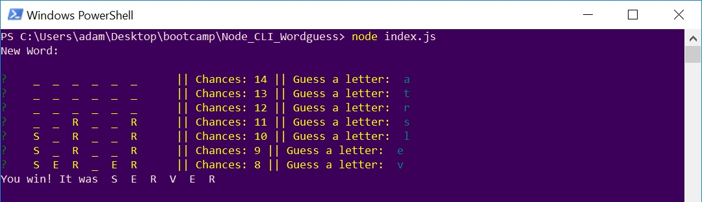
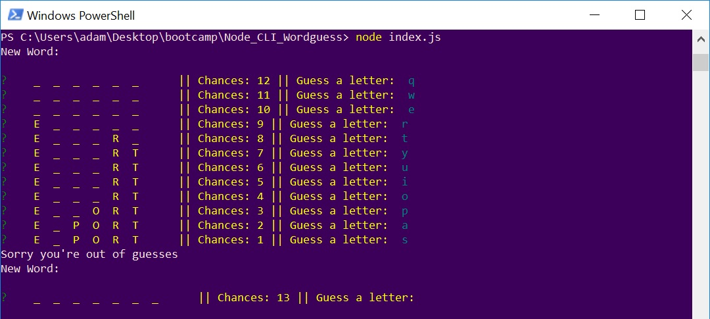
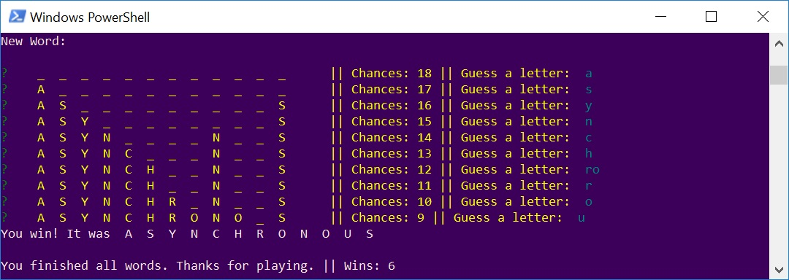

# Node CLI Wordguess

## Description
Word guessing game that runs from with node at the Command Line Interface.

#### Play

##### Winning
The number of letters in the word to guess are displayed as underscores. Type a letter and press enter to guess. If the letter was correct it will be displayed instead of the underscore. Guess all letters to win.

##### Chances 
Number of chances are based off word length. Lose the round if you run out of guesses before finished the word. Next word will start automatically.

##### Game Completed
When you have completed all words game will end. Your total wins will be displayed.

## Project
This is is a class Assignmnent for UCI coding bootcamp. Assignment focuses on the use of constructors in Javascript.

#### Requirements
##### `letter.js`
- constructor for letter objects containing:
  - a string of the letter
  - a boolean if letter is guessed yet
  - a function which return stored string if guessed, or placeholder symbol
  - a function which takes guess as an argument and checks if it matches letter string

##### `word.js`
- Requires `letter.js`
- contructor for word objects containing:
  - An array of `new` Letter objects representing word
  - A function that returns a string representing the word, using Letter prototype function
  - A function that takes a character as an argument and calls the guess function on each letter object

##### `index.js`
- Requires `word.js`
- Game functionality:
  - Randomly selects words
  - Uses `inquirer` or `prompt` npm package

#### Future Development:
- [ ] Input validation: only accept single alpha character
- [ ] Display previously guessed characters
- [ ] Disable repeat guesses